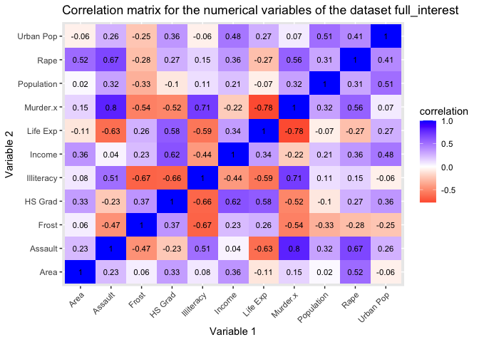
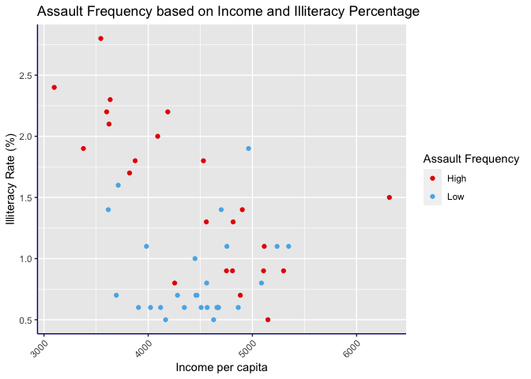
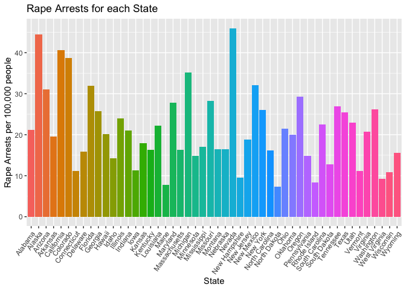
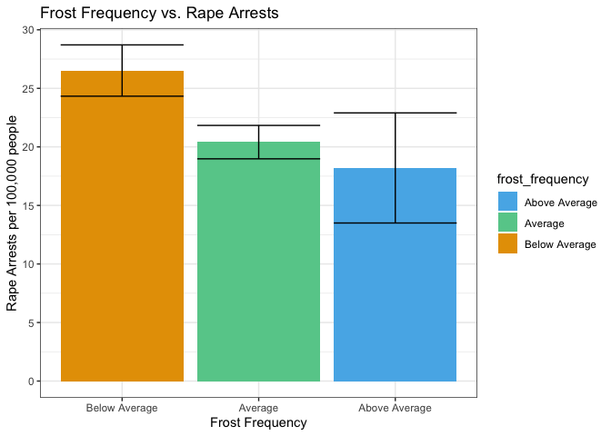
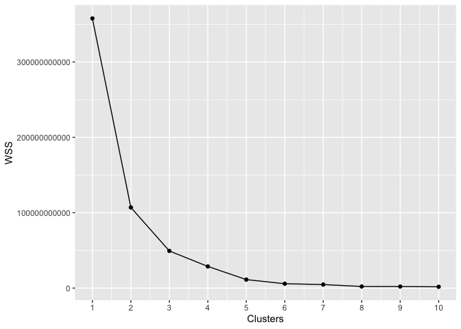
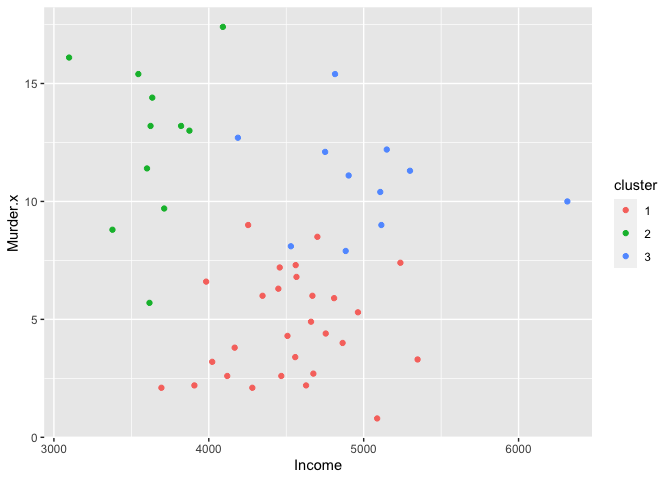
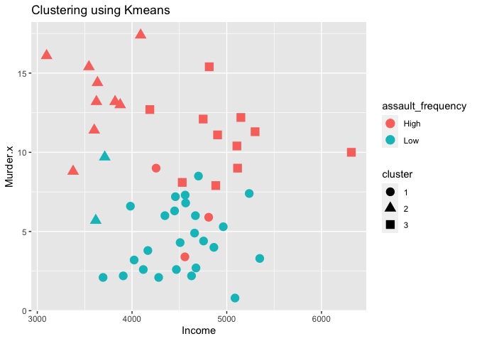
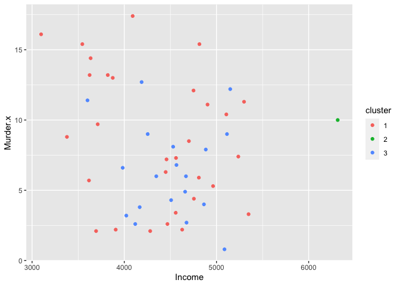

SDS 348 Project 1 - What Might Influence the Prevalence of Certain
Crimes?
================
Treyce Money tem2247

## Necessary Packages

``` r
library(datasets)
library(tidyr)
library(dplyr)
library(tidyverse)
library(ggplot2)
library(cluster)
library(knitr)
library(kableExtra)
# loads in all necessary libraries
```

# Introduction

### For this project, I chose two datasets from the “datasets” package to compare: the USArrests dataset, containing arrest statistics for each U.S. state in 1973, and the state.x77 dataset, containing numerous statistics of each U.S. state in 1970s.

##### As seen below, the “USArrests” dataset contains the variables “Murder”, “Assault”, “UrbanPop”, and “Rape”. Each row represents a different U.S. state. “UrbanPop” is the percentage of the population in each state that live in an urban area. Each variable besides “UrbanPop” represents the number of arrests per crime type per 100,000 people.

``` r
head(USArrests) #gives head of USArrests, shows all variables and row format
```

    ##            Murder Assault UrbanPop Rape
    ## Alabama      13.2     236       58 21.2
    ## Alaska       10.0     263       48 44.5
    ## Arizona       8.1     294       80 31.0
    ## Arkansas      8.8     190       50 19.5
    ## California    9.0     276       91 40.6
    ## Colorado      7.9     204       78 38.7

##### “state.x77” contains the variables “Population”, “Income”, “Illiteracy”, “Life Exp”, “Murder”, “HS Grad”, “Frost”, and “Area”. Each row represents a different U.S. state. “Population” is the population in thousands. Income is the per capita income in dollars. “Illiteracy” is the illiteracy rate. “Life Exp” is the life expectancy in years. “Murder” is the amount of murders per 100,000 people. “HS Grad” is the high school graduation rate. “Frost” is the average number of days each year with a minimum temperature below freezing in the state capital or other large city. “Area” is the land area in square miles.

``` r
head(state.x77) #gives head of state.x77, shows all variables and row format
```

    ##            Population Income Illiteracy Life Exp Murder HS Grad Frost   Area
    ## Alabama          3615   3624        2.1    69.05   15.1    41.3    20  50708
    ## Alaska            365   6315        1.5    69.31   11.3    66.7   152 566432
    ## Arizona          2212   4530        1.8    70.55    7.8    58.1    15 113417
    ## Arkansas         2110   3378        1.9    70.66   10.1    39.9    65  51945
    ## California      21198   5114        1.1    71.71   10.3    62.6    20 156361
    ## Colorado         2541   4884        0.7    72.06    6.8    63.9   166 103766

#### Every past statistics project of mine (even the SDS 328M project) has utilized data about medicine or music, my career interest and main hobby respectively, so I wanted to use data that had nothing to do with either of those topics. The datasets I am using both are easy to access in R/RStudio (as they are found in the preinstalled “datasets” package), which made it so I did not have to worry about utilizing outside programs/data types such as Excel. Both the USArrests dataset and the state.x77 dataset deal with variables that I have never really looked into before, and I wanted to see what potential correlations, if any, existed between the datasets. Before running any hypothesis/data testing, I expect there to be some positive correlation between all arrest rates and a combination of “Illiteracy” and “HS Grad”.

# Tidying and Joining the Datasets

``` r
Arrests_data <- setNames(cbind(rownames(USArrests), USArrests, row.names = NULL), c("State", "Murder", "Assault", "Urban Pop", "Rape")) # creates new dataset from USArrests data to manipulate/wrangle
state_data <- setNames(cbind(rownames(state.x77), state.x77, row.names = NULL), c("State", "Population", "Income", "Illiteracy", "Life Exp", "Murder", "HS Grad", "Frost", "Area")) #creates new dataset from state.x77 data to manipulate/wrangle
colnames(state_data) <- c("State", "Population", "Income", "Illiteracy", "Life Exp", "Murder", "HS Grad", "Frost", "Area") #assigns correct column names to state_data before it is turned into a dataframe
state_data <- as.data.frame((state_data)) #turns state_data into a dataframe
full <- full_join(Arrests_data, state_data, by = "State") # full joins Arrests_data and state_data
str(full) # gives head of full join of "Arrests_data" and "state_data" and data types of variables
```

    ## 'data.frame':    50 obs. of  13 variables:
    ##  $ State     : chr  "Alabama" "Alaska" "Arizona" "Arkansas" ...
    ##  $ Murder.x  : num  13.2 10 8.1 8.8 9 7.9 3.3 5.9 15.4 17.4 ...
    ##  $ Assault   : int  236 263 294 190 276 204 110 238 335 211 ...
    ##  $ Urban Pop : int  58 48 80 50 91 78 77 72 80 60 ...
    ##  $ Rape      : num  21.2 44.5 31 19.5 40.6 38.7 11.1 15.8 31.9 25.8 ...
    ##  $ Population: chr  "3615" "365" "2212" "2110" ...
    ##  $ Income    : chr  "3624" "6315" "4530" "3378" ...
    ##  $ Illiteracy: chr  "2.1" "1.5" "1.8" "1.9" ...
    ##  $ Life Exp  : chr  "69.05" "69.31" "70.55" "70.66" ...
    ##  $ Murder.y  : chr  "15.1" "11.3" "7.8" "10.1" ...
    ##  $ HS Grad   : chr  "41.3" "66.7" "58.1" "39.9" ...
    ##  $ Frost     : chr  "20" "152" "15" "65" ...
    ##  $ Area      : chr  "50708" "566432" "113417" "51945" ...

#### The above code joins the “USArrests” and “state.x77” datasets into one.

##### I first made new datasets from the “USArrests” and “state.x77” datasets in order to join them, as “Arrests\_data” and “state\_data” respectively. I then made sure that “state\_data” had the correct variable/column names, and then made “state\_data” a dataframe. I then used “full\_join” on “Arrests\_data” and “state\_data”.

##### I used a full join as I wanted to be able to see correlations between the all of the variables in “state.x77” and “USArrests”, instead of erasing variables that are not shared between datasets. A full join might have caused issues in tidying up the data if the datasets I was joining contained many more variables.

``` r
full_interest <- full %>% select(-Murder.y) %>% mutate(assault_frequency = case_when(Assault > 170 ~ "High", Assault <= 170 ~ "Low")) # removes "Murder.y" and creates the "assault_frequency" variable
full_interest <- full_interest %>% mutate_at(2:12, function(x)as.numeric(as.character(x))) # changes numerical variables from "character" data type to the "numeric" data type
str(full_interest) #shows change of variables from "character" data type to "numeric" data type
```

    ## 'data.frame':    50 obs. of  13 variables:
    ##  $ State            : chr  "Alabama" "Alaska" "Arizona" "Arkansas" ...
    ##  $ Murder.x         : num  13.2 10 8.1 8.8 9 7.9 3.3 5.9 15.4 17.4 ...
    ##  $ Assault          : num  236 263 294 190 276 204 110 238 335 211 ...
    ##  $ Urban Pop        : num  58 48 80 50 91 78 77 72 80 60 ...
    ##  $ Rape             : num  21.2 44.5 31 19.5 40.6 38.7 11.1 15.8 31.9 25.8 ...
    ##  $ Population       : num  3615 365 2212 2110 21198 ...
    ##  $ Income           : num  3624 6315 4530 3378 5114 ...
    ##  $ Illiteracy       : num  2.1 1.5 1.8 1.9 1.1 0.7 1.1 0.9 1.3 2 ...
    ##  $ Life Exp         : num  69 69.3 70.5 70.7 71.7 ...
    ##  $ HS Grad          : num  41.3 66.7 58.1 39.9 62.6 63.9 56 54.6 52.6 40.6 ...
    ##  $ Frost            : num  20 152 15 65 20 166 139 103 11 60 ...
    ##  $ Area             : num  50708 566432 113417 51945 156361 ...
    ##  $ assault_frequency: chr  "High" "High" "High" "High" ...

#### In the code above, I finish tidying and joining my two datasets.

##### I first create a new dataframe, “full\_interest”, which will contain all the variables I am interested in running data analysis on. I removed “Murder.y” from “full”, as “Murder.y” is the equivalent of “Murder” from “state\_data”. I dropped “Murder.y” (data from 1976) as I am primarily concerned with comparing the arrest rates from “Arrests\_data” (data from 1973) to variables from “state\_data”. “Murder.y” was the only variable/case I had to drop, as I wanted to only consider a single measurement of the “Murder” variable.

##### I created a new variable “assault\_frequency” to show when a state has a higher/lower amount of assaults than the mean of 170. I use it often in the later sections.

##### I then changed all of the numerical variables that are not the “numeric” data type from the “character” data type to the “numeric” data type. This is necessary in order to actually do mathematical computations with them in the “Summary Statistics” section. Joining and Tidying the datasets is now complete.

# Summary Statistics

### This section shows the usage of the main dplyr functions to explore my new dataset.

``` r
full_interest <- full_interest %>% mutate(frost_frequency = case_when(Frost > 156 ~ "Above Average", Frost <= 156 & Frost >= 52 ~"Average", Frost < 52~"Below Average")) # creates new variable frost_frequency using case_when
modified_data1 <- full_interest %>% filter(State == "Texas") %>% select(Murder.x, Income, "HS Grad", assault_frequency) # creates new dataframe with Texas as the only state, and showing only specific variables
as.data.frame(head(modified_data1)) # shows resulting dataframe from above code
```

    ##   Murder.x Income HS Grad assault_frequency
    ## 1     12.7   4188    47.4              High

#### To start, I used the mutate function to create a new variable “frost\_frequency”. I use this variable later in some graphs. I had already used mutate in the “Tidying and Joining the Datasets” section to create “assault\_frequency”, but I used mutate again to create a new variable I use later.

#### I then used the filter and select functions to view the “Murder.x”, “Income”, “HS Grad” and “assault\_frequency” variables for the state of Texas.

``` r
modified_data2 <- full_interest %>% group_by(State) %>% arrange(desc(`Urban Pop`)) # creates new dataframe that lists the states by their "Urban Pop" variable in descending order
as.data.frame(head(modified_data2)) # shows resulting dataframe from above code 
```

    ##           State Murder.x Assault Urban Pop Rape Population Income Illiteracy
    ## 1    California      9.0     276        91 40.6      21198   5114        1.1
    ## 2    New Jersey      7.4     159        89 18.8       7333   5237        1.1
    ## 3  Rhode Island      3.4     174        87  8.3        931   4558        1.3
    ## 4      New York     11.1     254        86 26.1      18076   4903        1.4
    ## 5 Massachusetts      4.4     149        85 16.3       5814   4755        1.1
    ## 6        Hawaii      5.3      46        83 20.2        868   4963        1.9
    ##   Life Exp HS Grad Frost   Area assault_frequency frost_frequency
    ## 1    71.71    62.6    20 156361              High   Below Average
    ## 2    70.93    52.5   115   7521               Low         Average
    ## 3    71.90    46.4   127   1049              High         Average
    ## 4    70.55    52.7    82  47831              High         Average
    ## 5    71.83    58.5   103   7826               Low         Average
    ## 6    73.60    61.9     0   6425               Low   Below Average

#### In the code above, I use the group\_by and arrange functions to list the states from the state with the highest Urban Population proportion to the lowest proportion. I expected all of the six states shown to be fairly high up, as most of the population in states like California and New York are centered in the cities of Los Angeles and New York City respectively

``` r
summary_stat_vars <- c("State", "Murder.x", "Assault", "Urban Pop", "Rape", "Population", "Income", "Illiteracy", "Life Exp", "HS Grad", "Frost", "Area", "assault_frequency", "frost_frequency") #makes a list of all variables in full_interest
summary_data <- full_interest %>% select(summary_stat_vars) %>% select_if(is.numeric) #takes list of variables in full_interest, picks which ones are numeric, and turns those into a new dataframe
summary_data %>% summarize_all(list(Mean=mean)) #finds mean of all numeric variables
```

    ##   Murder.x_Mean Assault_Mean Urban Pop_Mean Rape_Mean Population_Mean
    ## 1         7.788       170.76          65.54    21.232         4246.42
    ##   Income_Mean Illiteracy_Mean Life Exp_Mean HS Grad_Mean Frost_Mean Area_Mean
    ## 1      4435.8            1.17       70.8786       53.108     104.46  70735.88

``` r
summary_data %>% summarize_all(list(StdDev = sd)) #finds standard deviation of all numeric variables
```

    ##   Murder.x_StdDev Assault_StdDev Urban Pop_StdDev Rape_StdDev Population_StdDev
    ## 1         4.35551       83.33766         14.47476    9.366385          4464.491
    ##   Income_StdDev Illiteracy_StdDev Life Exp_StdDev HS Grad_StdDev Frost_StdDev
    ## 1      614.4699         0.6095331        1.342394       8.076998     51.98085
    ##   Area_StdDev
    ## 1     85327.3

``` r
summary_data %>% summarize_all(list(Variance = var)) #finds variance of all numeric variables
```

    ##   Murder.x_Variance Assault_Variance Urban Pop_Variance Rape_Variance
    ## 1          18.97047         6945.166           209.5188      87.72916
    ##   Population_Variance Income_Variance Illiteracy_Variance Life Exp_Variance
    ## 1            19931684        377573.3           0.3715306           1.80202
    ##   HS Grad_Variance Frost_Variance Area_Variance
    ## 1         65.23789       2702.009    7280748061

``` r
summary_data %>% summarize_all(list(Min = min)) #finds minimum of all numeric variables
```

    ##   Murder.x_Min Assault_Min Urban Pop_Min Rape_Min Population_Min Income_Min
    ## 1          0.8          45            32      7.3            365       3098
    ##   Illiteracy_Min Life Exp_Min HS Grad_Min Frost_Min Area_Min
    ## 1            0.5        67.96        37.8         0     1049

``` r
summary_data %>% summarize_all(list(Max = max)) #finds maximum of all numeric variables
```

    ##   Murder.x_Max Assault_Max Urban Pop_Max Rape_Max Population_Max Income_Max
    ## 1         17.4         337            91       46          21198       6315
    ##   Illiteracy_Max Life Exp_Max HS Grad_Max Frost_Max Area_Max
    ## 1            2.8         73.6        67.3       188   566432

``` r
full_interest %>% summarize(cor = cor(Murder.x, Income)) # uses summarize on the "Income" variable, finding the correlation between "Income" and "Murder.x"
```

    ##         cor
    ## 1 -0.215205

``` r
full_interest %>% group_by(assault_frequency) %>% summarize(mean_murder = mean(Murder.x), sd_murder = sd(Murder.x), min_Murder = min(Murder.x), max_murder = max(Murder.x), variance = var(Murder.x, y = NULL, na.rm = FALSE)) #uses group_by and summarize to compare the difference in "Murder.x" between the two groupings of "assault_frequency"
```

    ## # A tibble: 2 x 6
    ##   assault_frequency mean_murder sd_murder min_Murder max_murder variance
    ##   <chr>                   <dbl>     <dbl>      <dbl>      <dbl>    <dbl>
    ## 1 High                    11.4       3.37        3.4       17.4    11.3 
    ## 2 Low                      4.74      2.28        0.8        9.7     5.19

#### In the code above, I use the last dplyr function, summarize, in three different ways.

##### I first use summarize\_all multiple times to find numerous summary values of every numeric variable in “full\_interest”.

##### Second, I use summarize to find the correlation between “Income” and “Murder.x” across the entire dataset (all 50 states). This shows there exists a weak negative correlation between “Income” and “Murder.x”, which I expected to be true.

##### Last, I use group\_by and summarize to view the difference in “Murder.x” between the two groups of “assault\_frequency”. This shows that there is a higher value of “Murder.x” among states with a higher than average value of “Assault”. I assumed before doing any data manipulation that there would be higher levels of the other types of arrests in states with a higher than average “Assault” value, but I did not think that there would be such a disparity between the two groups. Mean\_murder, min\_murder, and max\_murder are all significantly higher in the “High” group compared to the “Low” group.

### This completes the Summary Statistics section.

# Visualizations

### This section shows 4 visualizations, the first being the correlation heatmap, and the others being graphs that further explore the variables “assault\_frequency”, “frost\_frequency”, and “Rape”.

``` r
cor(summary_data , use = "pairwise.complete.obs") %>%
  as.data.frame %>%
  rownames_to_column %>%
  pivot_longer(-1, names_to = "other_var", values_to = "correlation") %>%
  ggplot(aes(rowname, other_var, fill=correlation)) +
  geom_tile() +
  scale_fill_gradient2(low="red", mid="white", high="blue") +
  geom_text(aes(label = round(correlation, 2)), color = "black", size = 3) + 
  theme(axis.text.x = element_text(angle = 45, hjust = 1)) + #changes angle of x-axis text
  labs(title = "Correlation matrix for the numerical variables of the dataset full_interest", x = "Variable 1", y = "Variable 2") #gives title to graph and labels to both axes
```



#### The above code is the correlation heatmap for the entire dataset, showing the relationship, if any, between each numeric variable. I had to change the angle of the text for the “Variable 1” axis labels so that it was not bunched up and unreadable. The heatmap shows that arrests of all types have a high positive correlation with each other. As I predicted, Illiteracy does have a positive correlation with Assault and Murder.

``` r
ggplot(full_interest, aes(Income, Illiteracy)) + #defines the two axes of the graph
  geom_point(aes(color = assault_frequency)) + #colors points on graph by "assault_frequency" value
  xlab("Income per capita") + #labels x-axis
  ylab("Illiteracy Rate (%)") + #labels y-axis
  labs(colour = "Assault Frequency") + #colors the legend based on "assault_frequency" value
  theme(axis.text.x = element_text(angle=45, hjust=1)) +
  ggtitle("Assault Frequency based on Income and Illiteracy Percentage") + #gives title to graph
  scale_y_continuous(breaks=seq(0,3,0.5)) +
  theme( axis.line = element_line(colour = "darkblue", 
                      size = 0.5, linetype = "solid")) + #gives color to the actual axes of the graph
  scale_color_manual(values=c("#E60000", "#56B4E9")) #chooses the two colors for the points on the graph
```



#### This second graph shows plots the variables “Income”, “Illiteracy”, and “assault\_frequency”. There seems to be a negative correlation between illiteracy and Income per capita, as illiteracy decreases as Income increases. There also seems to be a positive relationship between illiteracy and “assault\_frequency”. A “High” assault\_frequency is present for every illiteracy rate above 2 %. The relationship between “assault\_frequency” and Income per capita is harder to distinguish from this graph, but the correlation heatmap gives a correlation value of 0.04, showing there is an insignificant relationship.

``` r
ggplot(full_interest, aes(State))+ #defines what is plotted on x-axis
  geom_bar(aes(y=Rape, fill = State), stat="summary", fun.y="mean") + #makes graph be a bar plot, gives what variable the bar is measuring
  theme(axis.text.x = element_text(angle=55, hjust=1)) + #changes angle of labels for each state
  ylab("Rape Arrests per 100,000 people") + #labels y-axis
  ggtitle("Rape Arrests for each State") + #gives title to entire graph
  theme(legend.position="none") # removes legend for graph
```



#### This third graph graphs the amount of rapes per 100,000 people for each U.S. state. I honestly just made this to see what a rainbow graph might look like, and maybe make light of the fact that there are so many arrests solely for rape.

``` r
ggplot(full_interest, aes(frost_frequency, y=Rape, fill = `frost_frequency`)) + #sets variables being measured on both axes
  geom_bar(stat="summary", fun.y="mean") + #gives limit for height of bar as the mean of "Frost" in each value of "frost_frequency" 
  geom_errorbar(stat="summary") + #finds 1st quantile, mean, and 3rd quantile of each value of "frost_frequency" and produces error bars
  theme(axis.text.x = element_text(angle=0, hjust=0.5)) +
  ggtitle("Frost Frequency vs. Rape Arrests") + #gives title to entire graph
  ylab("Rape Arrests per 100,000 people") + #gives label to y-axis
  xlab("Frost Frequency") + #gives label to x-axis
  labs(colour = "Frost Frequency") + #differentiates the color of each bar by the value of "frost_frequency"
  scale_y_continuous(breaks=seq(0,30,5)) +
  scale_x_discrete(limits=c("Below Average", "Average", "Above Average")) + #gives label to each bar
  scale_fill_manual(values=c("#56B4E9", "#66CC99", "#E69F00")) + #gives specific color to each bar
  theme_bw() #makes graph have white background
```



#### This last graph compares the number of rape arrests, with error bars, to “frost\_frequency”. This shows that in states with a below average number of Frost days there is a higher number of rape arrests. This could be due to any number of reasons, such as people being outside doing activities more often in warmer areas. I color coded each bar to be based off of the temperature it represented: orange for hotter areas, green for normal areas, and blue for colder areas.

### This concludes the Visualizations section.

# Dimensionality Reduction

### This section utilizes clustering and pam to further explore my dataset, while also using a few graphs.

``` r
options(scipen = 999)
wss <- vector()
for(i in 1:10){ 
  temp <- full_interest %>% dplyr::select(Murder.x,Assault, `Urban Pop`, Rape, Population, Income,`Illiteracy`,`Life Exp`, `HS Grad`, Frost, Area) %>%
  kmeans(.,i)
  wss[i]<-temp$tot.withinss 
} #creates the different data clusters using kmeans
ggplot() + geom_point(aes(x=1:10, y=wss)) + geom_path(aes(x=1:10, y=wss)) + xlab("Clusters") + ylab("WSS") + scale_x_continuous(breaks=1:10) #creates the graph of the different percentages for each cluster
```



#### The first chunk of code in this section creates the graph to determine how many clusters I should select for further analysis. I used kmeans to generate the clusters. Based on the graph, I will use 3 clusters for further analysis, as 3 clusters is where the “bend” of the plot is located.

``` r
cluster_data <- summary_data #assigns all full_interest numeric variables to new dataset
kmeans1 <- cluster_data %>% scale %>% kmeans(3) #scales data and performs kmeans
kmeanscluster <- cluster_data %>% mutate(cluster = as.factor(kmeans1$cluster))
kmeanscluster %>% ggplot(aes(Income, Murder.x, color = cluster)) + geom_point() #creates graph of "Murder.x" versus "Income" that colors points by cluster
```



``` r
kmeanscluster %>% mutate(assault_frequency = full_interest$assault_frequency) %>%
  ggplot(aes(Income, Murder.x, color = assault_frequency, shape = cluster)) + geom_point(size=4) + ggtitle("Clustering using Kmeans") #graphs "Murder.x" versus "Income", while attributing cluster and "assault_frequency" data  by means of shape and color respectively
```



#### The two graphs above show how certain variables differ among the 3 clusters.

##### The first graph shows that “Murder.x” differs wildly between each cluster. Cluster 1 has relatively high values for both Murder and Income, Cluster 2 has low income and very high Murder arrests, and Cluster 3 has a wide range of Income and a lower than average Murder.

##### The second graph adds “assault\_frequency” into the mix of the first graph. Cluster 1 and 2, as the clusters with the relative highest amount of murder arrests, also have the highest amount of “High” values for “assault\_frequency”, further illustrating the positive correlation between all types of arrests (i.e. if one type of arrest is high, then the other arrest types are probably comparable).

``` r
pam1 <- cluster_data %>% pam(k=3)
pam_cluster <- cluster_data %>% mutate(cluster = as.factor(pam1$clustering))
pam_cluster %>% ggplot(aes(Income, Murder.x, color = cluster)) + geom_point() #creates point graph of the different variables, distinguishing clusters by color
```



``` r
pam_cluster %>% group_by(cluster) %>% summarize_if(is.numeric, mean, na.rm=T) #creates pam tibble showing variable data by cluster
```

    ## # A tibble: 3 x 12
    ##   cluster Murder.x Assault `Urban Pop`  Rape Population Income Illiteracy
    ##   <fct>      <dbl>   <dbl>       <dbl> <dbl>      <dbl>  <dbl>      <dbl>
    ## 1 1           8.58    173.        64.7  18.7      4884.  4336.       1.33
    ## 2 2          10       263         48    44.5       365   6315        1.5 
    ## 3 3           6.42    162.        67.8  24.0      3445.  4494.       0.9 
    ## # … with 4 more variables: Life Exp <dbl>, HS Grad <dbl>, Frost <dbl>,
    ## #   Area <dbl>

#### The above code ran PAM analysis on the clusters. Using pam did not necessarily reveal any variable correlations based on cluster that was not apparent in the preceding graphs.

### This concludes the Dimensionality Reduction section.

# This is the end of Project 1 for SDS 348 Spring 2021.

------------------------------------------------------------------------

    ##                                                                                             sysname 
    ##                                                                                            "Darwin" 
    ##                                                                                             release 
    ##                                                                                            "18.7.0" 
    ##                                                                                             version 
    ## "Darwin Kernel Version 18.7.0: Tue Jan 12 22:04:47 PST 2021; root:xnu-4903.278.56~1/RELEASE_X86_64" 
    ##                                                                                            nodename 
    ##                                                                                 "MacBook-Pro.local" 
    ##                                                                                             machine 
    ##                                                                                            "x86_64" 
    ##                                                                                               login 
    ##                                                                                       "treycemoney" 
    ##                                                                                                user 
    ##                                                                                       "treycemoney" 
    ##                                                                                      effective_user 
    ##                                                                                       "treycemoney"
