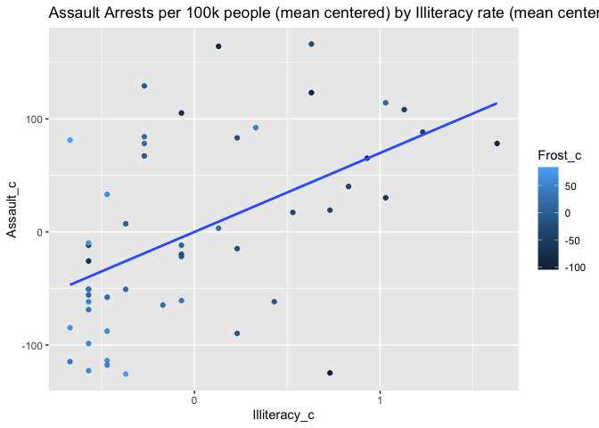
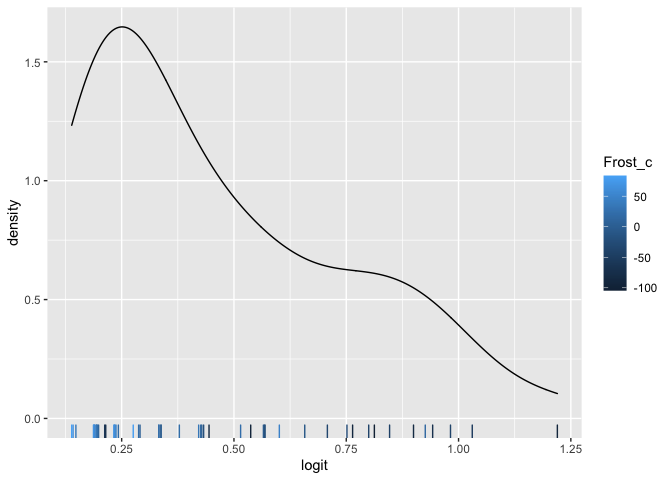

SDS 348 Project 2: Modeling, Testing and Predicting
================
Treyce Money tem2247

## Necessary Packages

``` r
library(datasets)
library(tidyr)
library(dplyr)
library(tidyverse)
library(ggplot2)
library(knitr)
library(mvtnorm)
library(lmtest)
library(ggstance)
library(sandwich)
library(interactions)
library(plotROC)
# loads in all necessary libraries
```

# Introduction

### For this project, I chose to use the dataset I created in Project 1, which used datasets from the “datasets” package: the USArrests dataset, containing arrest statistics for each U.S. state in 1973, and the state.x77 dataset, containing numerous statistics of each U.S. state in 1970s.

##### As seen below, the “USArrests” dataset contains the variables “Murder”, “Assault”, “UrbanPop”, and “Rape”. Each row represents a different U.S. state. “UrbanPop” is the percentage of the population in each state that live in an urban area. Each variable besides “UrbanPop” represents the number of arrests per crime type per 100,000 people.

``` r
head(USArrests) #gives head of USArrests, shows all variables and row format
```

    ##            Murder Assault UrbanPop Rape
    ## Alabama      13.2     236       58 21.2
    ## Alaska       10.0     263       48 44.5
    ## Arizona       8.1     294       80 31.0
    ## Arkansas      8.8     190       50 19.5
    ## California    9.0     276       91 40.6
    ## Colorado      7.9     204       78 38.7

#### “state.x77” contains the variables “Population”, “Income”, “Illiteracy”, “Life Exp”, “Murder”, “HS Grad”, “Frost”, and “Area”. Each row represents a different U.S. state. “Population” is the population in thousands. Income is the per capita income in dollars. “Illiteracy” is the illiteracy rate. “Life Exp” is the life expectancy in years. “Murder” is the amount of murders per 100,000 people. “HS Grad” is the high school graduation rate. “Frost” is the average number of days each year with a minimum temperature below freezing in the state capital or other large city. “Area” is the land area in square miles.

``` r
head(state.x77) #gives head of state.x77, shows all variables and row format
```

    ##            Population Income Illiteracy Life Exp Murder HS Grad Frost   Area
    ## Alabama          3615   3624        2.1    69.05   15.1    41.3    20  50708
    ## Alaska            365   6315        1.5    69.31   11.3    66.7   152 566432
    ## Arizona          2212   4530        1.8    70.55    7.8    58.1    15 113417
    ## Arkansas         2110   3378        1.9    70.66   10.1    39.9    65  51945
    ## California      21198   5114        1.1    71.71   10.3    62.6    20 156361
    ## Colorado         2541   4884        0.7    72.06    6.8    63.9   166 103766

#### The below code creates the dataset that I used for Project 1.

``` r
Arrests_data <- setNames(cbind(rownames(USArrests), USArrests, row.names = NULL), c("State", "Murder", "Assault", "Urban Pop", "Rape")) # creates new dataset from USArrests data to manipulate/wrangle
state_data <- setNames(cbind(rownames(state.x77), state.x77, row.names = NULL), c("State", "Population", "Income", "Illiteracy", "Life Exp", "Murder", "HS Grad", "Frost", "Area")) #creates new dataset from state.x77 data to manipulate/wrangle
colnames(state_data) <- c("State", "Population", "Income", "Illiteracy", "Life Exp", "Murder", "HS Grad", "Frost", "Area") #assigns correct column names to state_data before it is turned into a dataframe
state_data <- as.data.frame((state_data)) #turns state_data into a dataframe
full <- full_join(Arrests_data, state_data, by = "State") # full joins Arrests_data and state_data
full_interest <- full %>% select(-Murder.y) %>% mutate(assault_frequency = case_when(Assault > 170 ~ "High", Assault <= 170 ~ "Low")) # removes "Murder.y" and creates the "assault_frequency" variable
full_interest <- full_interest %>% mutate_at(2:12, function(x)as.numeric(as.character(x))) # changes numerical variables from "character" data type to the "numeric" data type
full_interest <- full_interest %>% mutate(frost_frequency = case_when(Frost > 156 ~ "Above Average", Frost <= 156 & Frost >= 52 ~"Average", Frost < 52~"Below Average")) # creates new variable frost_frequency using case_when
full_interest <- full_interest %>% rename(Murder = Murder.x) #renames "Murder.x" to "Murder"
```

#### For the sake of this project, I will be utilizing the following categorical/independent variables: “Income”, “Illiteracy”, “HS Grad” and “Frost”/“frost\_frequency”. I will be utilizing the following response/dependent variables: “Murder”, “Assault”/“assault\_frequency”, and “Rape”.

#### Most past statistics projects of mine have utilized data about medicine or music, my career interest and main hobby respectively, so I wanted to use data that had nothing to do with either of those topics. The datasets I am using both are easy to access in R/RStudio (as they are found in the preinstalled “datasets” package), which made it so I did not have to worry about utilizing outside programs/data types such as Excel. Both the USArrests dataset and the state.x77 dataset deal with variables that I have never really looked into before, and I wanted to see what potential correlations, if any, existed between the datasets. Before running any hypothesis/data testing (and based off of my knowledge from Project 1), I expect there to be some positive correlation between all arrest rates and “Illiteracy”, and negative correlation between all arrest rates and “HS Grad”, “Income”, and “Frost”/“frost\_frequency”.

# MANOVA

### This section utilizes MANOVA to determine the effect of “Income” on the different types of arrests.

### To start, I plotted the different arrest types against “Income”.

``` r
ggplot(full_interest, aes(x = Income, y = Murder)) + geom_point(alpha = .5) + geom_density_2d(h = 2) #plots Murder vs Income
```


``` r
ggplot(full_interest, aes(x = Income, y = Assault)) + geom_point(alpha = .5) + geom_density_2d(h = 2) #plots Assault vs Income
```


``` r
ggplot(full_interest, aes(x = Income, y = Rape)) + geom_point(alpha = .5) + geom_density_2d(h = 2) #plots Rape vs Income
```


``` r
manova1 <- manova(cbind(Murder, Assault, Rape) ~ Income , data = full_interest) #runs MANOVA on "Murder", "Assault", and "Rape" based on "Income"
summary(manova1) #shows MANOVA results, including significance level (p-value)
```

    ##           Df  Pillai approx F num Df den Df    Pr(>F)    
    ## Income     1 0.39614   10.059      3     46 3.266e-05 ***
    ## Residuals 48                                             
    ## ---
    ## Signif. codes:  0 '***' 0.001 '**' 0.01 '*' 0.05 '.' 0.1 ' ' 1

``` r
summary.aov(manova1) #shows individual ANOVA results for variables used in the previous MANOVA test
```

    ##  Response Murder :
    ##             Df Sum Sq Mean Sq F value Pr(>F)
    ## Income       1  43.05  43.051   2.331 0.1334
    ## Residuals   48 886.50  18.469               
    ## 
    ##  Response Assault :
    ##             Df Sum Sq Mean Sq F value Pr(>F)
    ## Income       1    570   570.2  0.0806 0.7778
    ## Residuals   48 339743  7078.0               
    ## 
    ##  Response Rape :
    ##             Df Sum Sq Mean Sq F value  Pr(>F)  
    ## Income       1  549.1  549.06  7.0285 0.01084 *
    ## Residuals   48 3749.7   78.12                  
    ## ---
    ## Signif. codes:  0 '***' 0.001 '**' 0.01 '*' 0.05 '.' 0.1 ' ' 1

#### I then ran MANOVA to actually test if the different arrest types overall were influenced by “Income”. As the test was significant, I viewed the univariate ANOVAs from the MANOVA to see that only rape arrests were significantly affected by “Income”.

``` r
pairwise.t.test(full_interest$Rape, full_interest$Income, p.adj = "none") #first attempt at post-hoc test
```

    ## 
    ##  Pairwise comparisons using t tests with pooled SD 
    ## 
    ## data:  full_interest$Rape and full_interest$Income 
    ## 
    ##      3098 3378 3545 3601 3617 3624 3635 3694 3712 3821 3875 3907 3983 4022 4091
    ## 3378 -    -    -    -    -    -    -    -    -    -    -    -    -    -    -   
    ## 3545 -    -    -    -    -    -    -    -    -    -    -    -    -    -    -   
    ##      4119 4167 4188 4254 4281 4347 4449 4458 4468 4508 4530 4558 4561 4566 4628
    ## 3378 -    -    -    -    -    -    -    -    -    -    -    -    -    -    -   
    ## 3545 -    -    -    -    -    -    -    -    -    -    -    -    -    -    -   
    ##      4660 4669 4675 4701 4751 4755 4809 4815 4864 4884 4903 4963 5087 5107 5114
    ## 3378 -    -    -    -    -    -    -    -    -    -    -    -    -    -    -   
    ## 3545 -    -    -    -    -    -    -    -    -    -    -    -    -    -    -   
    ##      5149 5237 5299 5348
    ## 3378 -    -    -    -   
    ## 3545 -    -    -    -   
    ##  [ reached getOption("max.print") -- omitted 47 rows ]
    ## 
    ## P value adjustment method: none

``` r
fivenum(full_interest$Income) #finds 5 number summary for "Income"
```

    ## [1] 3098 3983 4519 4815 6315

``` r
full_interest <- full_interest %>% mutate(income_level = case_when(Income > 4815 ~ "Above Average", Income <= 4815 & Income >= 3983 ~ "Average", Income < 3983 ~"Below Average")) #creates new "income_level" variable
pairwise.t.test(full_interest$Rape, full_interest$income_level, p.adj="none") #second attempt at post-hoc test
```

    ## 
    ##  Pairwise comparisons using t tests with pooled SD 
    ## 
    ## data:  full_interest$Rape and full_interest$income_level 
    ## 
    ##               Above Average Average
    ## Average       0.012         -      
    ## Below Average 0.015         0.740  
    ## 
    ## P value adjustment method: none

#### Running the post-hoc analysis produced an empty matrix with no discernible p-values or data, so the work around involved creating a pseudo-categorical variable based on “Income”. The differences between “Above Average” and “Average”, and between “Above Average” and “Below Average” income levels are the contributing factors for the relationship between “Rape” and “Income”.

``` r
1 - (0.95^7) #finds probability of type 1 error
```

    ## [1] 0.3016627

``` r
0.05/7 #finds Boneferroni adjusted significance level
```

    ## [1] 0.007142857

#### I conducted a MANOVA test, 3 ANOVA tests, and a pairwise t test with 3 comparisons, meaning I conducted 7 tests in total. My Boneferroni adjusted significance level is “0.00714”. As a result of my adjusted significance level, none of my ANOVA derived tests are significant.

#### I do not meet most of the typical MANOVA assumptions. My dataset is not randomly sampled, as the arrest data available/used is the aggregated statistics published in 1973. The states whose data I am utilizing is not random either (as there are only the 50 U.S. states). The “Rape” statistic is positively skewed, and “Income” has a few outliers.

### This concludes the MANOVA section.

# Randomization Test

### This section uses a randomization test to test whether “Assault” differs based on “frost\_frequency”.

``` r
ggplot(full_interest, aes(Assault, fill = frost_frequency)) + geom_histogram(bins = 6.5) + facet_wrap(~frost_frequency, ncol=3) + scale_fill_manual(values=c("#56B4E9", "#66CC99", "#E69F00")) #groups "Assault" by "frost_frequency" and graphs it
```


``` r
true_diff <- full_interest %>% group_by(frost_frequency) %>% summarize(means = mean(Assault)) %>% summarize(mean_diff = diff(means)) %>% pull #calculates mean differences between different groupings of "Assault"
true_diff #reports mean differences between "Assault" groups
```

    ## [1] 59.93548 48.06452

``` r
true_diff_mean <- mean(true_diff) #finds average difference between "Assault" groups
true_diff_mean
```

    ## [1] 54

#### I first plotted “Assault” against its respective “frost\_frequency” value. I then found the mean of the observed differences between the three “Assault” groups to be 54.

``` r
set.seed(348)
diff_means_random <- vector() #entire randomization test utilizing samples of Assault

for(i in 1:1000){
  temp <- full_interest %>% 
    mutate(Assault = sample(Assault))
  
  diff_means_random[i] <- temp %>% 
    group_by(frost_frequency) %>%
    summarize(means = mean(Assault)) %>%
    summarize(diff_means_random = -diff(means)) %>%
    pull
}

{hist(diff_means_random, main = "Distribution of the mean differences of `Assault`"); abline(v = 54, col="red"); abline(v = -54, col="red")} #histogram of Assault means and shows confidence interval using value of "true_diff_mean"
```


``` r
sum(abs(diff_means_random) > abs(true_diff_mean))/1000 #finds p-value
```

    ## [1] 0.081

#### The Null hypothesis for this test is that “Assault” is the same for all values/groups of “frost\_frequency”. The Alternative hypothesis for this test is that “Assault” does significantly differ based on “frost\_frequency”. Using a 1000 repetition randomization test, the p-value gotten was 0.081. As the p-value is greater than 0.05, I fail to reject the null hypothesis. Based on the p-value, there is a 8.1% chance to observe a mean difference sample like that shown above.

### This concludes the Randomization Test section.

# Linear Regression

### This section uses linear regression to determine the numerical effect certain independent variables have on “Assault”, and whether or not the relationship between those variables and “Assault” is significant.

``` r
full_interest$Frost_c <- full_interest$Frost - mean(full_interest$Frost) #centers "Frost" variable around its mean
full_interest$HS_Grad_c <- full_interest$`HS Grad` - mean(full_interest$`HS Grad`) #centers "HS Grad" variable around its mean
full_interest$Assault_c <- full_interest$Assault - mean(full_interest$Assault) #centers "Assault" variable around its mean
fit1 <- lm(Assault_c ~ Frost_c + HS_Grad_c, data = full_interest) #linear model using "Frost_c" and "HS_Grad_c"
summary(fit1) #shows variable coefficients and significance levels 
```

    ## 
    ## Call:
    ## lm(formula = Assault_c ~ Frost_c + HS_Grad_c, data = full_interest)
    ## 
    ## Residuals:
    ##     Min      1Q  Median      3Q     Max 
    ## -192.88  -46.20  -18.53   60.30  149.07 
    ## 
    ## Coefficients:
    ##               Estimate Std. Error t value Pr(>|t|)   
    ## (Intercept)  2.113e-14  1.061e+01   0.000   1.0000   
    ## Frost_c     -7.109e-01  2.216e-01  -3.209   0.0024 **
    ## HS_Grad_c   -6.982e-01  1.426e+00  -0.490   0.6266   
    ## ---
    ## Signif. codes:  0 '***' 0.001 '**' 0.01 '*' 0.05 '.' 0.1 ' ' 1
    ## 
    ## Residual standard error: 75 on 47 degrees of freedom
    ## Multiple R-squared:  0.2232, Adjusted R-squared:  0.1902 
    ## F-statistic: 6.753 on 2 and 47 DF,  p-value: 0.002643

``` r
fit2 <- lm(Assault_c ~ Frost_c * HS_Grad_c, data = full_interest) #linear model using "Frost_c" and "HS_Grad_c" with interaction
summary(fit2) #shows variable coefficients and significance levels
```

    ## 
    ## Call:
    ## lm(formula = Assault_c ~ Frost_c * HS_Grad_c, data = full_interest)
    ## 
    ## Residuals:
    ##     Min      1Q  Median      3Q     Max 
    ## -149.90  -46.54  -23.84   52.11  140.65 
    ## 
    ## Coefficients:
    ##                    Estimate Std. Error t value Pr(>|t|)    
    ## (Intercept)       -11.24861   10.77170  -1.044 0.301815    
    ## Frost_c            -0.93124    0.22300  -4.176 0.000131 ***
    ## HS_Grad_c           0.86057    1.45473   0.592 0.557037    
    ## Frost_c:HS_Grad_c   0.07454    0.02737   2.724 0.009093 ** 
    ## ---
    ## Signif. codes:  0 '***' 0.001 '**' 0.01 '*' 0.05 '.' 0.1 ' ' 1
    ## 
    ## Residual standard error: 70.35 on 46 degrees of freedom
    ## Multiple R-squared:  0.3311, Adjusted R-squared:  0.2875 
    ## F-statistic:  7.59 on 3 and 46 DF,  p-value: 0.000317

``` r
full_interest$Illiteracy_c <- full_interest$Illiteracy - mean(full_interest$Illiteracy) #centers "Illiteracy" variable around its mean
fit3 <- lm(Assault_c ~ Frost_c + HS_Grad_c + Illiteracy_c, data = full_interest) #linear model using "Frost_c", "HS_Grad_c" and "Illiteracy_c" 
summary(fit3) #shows variable coefficients and significance levels
```

    ## 
    ## Call:
    ## lm(formula = Assault_c ~ Frost_c + HS_Grad_c + Illiteracy_c, 
    ##     data = full_interest)
    ## 
    ## Residuals:
    ##     Min      1Q  Median      3Q     Max 
    ## -221.24  -40.97  -18.48   46.06  147.02 
    ## 
    ## Coefficients:
    ##                Estimate Std. Error t value Pr(>|t|)  
    ## (Intercept)   4.713e-15  1.015e+01   0.000   1.0000  
    ## Frost_c      -3.303e-01  2.688e-01  -1.229   0.2254  
    ## HS_Grad_c     1.637e+00  1.700e+00   0.963   0.3406  
    ## Illiteracy_c  6.519e+01  2.829e+01   2.304   0.0258 *
    ## ---
    ## Signif. codes:  0 '***' 0.001 '**' 0.01 '*' 0.05 '.' 0.1 ' ' 1
    ## 
    ## Residual standard error: 71.78 on 46 degrees of freedom
    ## Multiple R-squared:  0.3036, Adjusted R-squared:  0.2582 
    ## F-statistic: 6.685 on 3 and 46 DF,  p-value: 0.0007704

``` r
fit4 <- lm(Assault_c ~ Frost_c * HS_Grad_c * Illiteracy_c, data = full_interest) #linear model using "Frost_c", "HS_Grad_c" and "Illiteracy_c" with interaction
summary(fit4) #shows variable coefficients and significance levels
```

    ## 
    ## Call:
    ## lm(formula = Assault_c ~ Frost_c * HS_Grad_c * Illiteracy_c, 
    ##     data = full_interest)
    ## 
    ## Residuals:
    ##     Min      1Q  Median      3Q     Max 
    ## -110.86  -44.44  -20.21   35.64  128.22 
    ## 
    ## Coefficients:
    ##                                Estimate Std. Error t value Pr(>|t|)   
    ## (Intercept)                    12.69255   12.39784   1.024  0.31180   
    ## Frost_c                        -0.89755    0.33945  -2.644  0.01147 * 
    ## HS_Grad_c                       2.01958    1.69618   1.191  0.24047   
    ## Illiteracy_c                   55.66018   31.50119   1.767  0.08451 . 
    ## Frost_c:HS_Grad_c               0.12492    0.04255   2.936  0.00538 **
    ## Frost_c:Illiteracy_c            1.14892    0.37919   3.030  0.00417 **
    ## HS_Grad_c:Illiteracy_c          2.07430    3.33093   0.623  0.53682   
    ## Frost_c:HS_Grad_c:Illiteracy_c -0.01535    0.04087  -0.376  0.70907   
    ## ---
    ## Signif. codes:  0 '***' 0.001 '**' 0.01 '*' 0.05 '.' 0.1 ' ' 1
    ## 
    ## Residual standard error: 64.53 on 42 degrees of freedom
    ## Multiple R-squared:  0.4861, Adjusted R-squared:  0.4004 
    ## F-statistic: 5.674 on 7 and 42 DF,  p-value: 0.0001172

``` r
fit5 <- lm(Assault_c ~ Frost_c + Illiteracy_c, data = full_interest) #linear model using "Frost_c" and "Illiteracy_c" with interaction
summary(fit5) #shows variable coefficients and significance levels
```

    ## 
    ## Call:
    ## lm(formula = Assault_c ~ Frost_c + Illiteracy_c, data = full_interest)
    ## 
    ## Residuals:
    ##     Min      1Q  Median      3Q     Max 
    ## -198.62  -41.91  -17.74   55.60  144.53 
    ## 
    ## Coefficients:
    ##                Estimate Std. Error t value Pr(>|t|)  
    ## (Intercept)   1.111e-14  1.014e+01   0.000   1.0000  
    ## Frost_c      -3.650e-01  2.662e-01  -1.371   0.1768  
    ## Illiteracy_c  4.895e+01  2.270e+01   2.157   0.0362 *
    ## ---
    ## Signif. codes:  0 '***' 0.001 '**' 0.01 '*' 0.05 '.' 0.1 ' ' 1
    ## 
    ## Residual standard error: 71.72 on 47 degrees of freedom
    ## Multiple R-squared:  0.2896, Adjusted R-squared:  0.2593 
    ## F-statistic: 9.578 on 2 and 47 DF,  p-value: 0.0003243

``` r
fit6 <- lm(Assault_c ~ Frost_c * Illiteracy_c, data = full_interest) #linear model using "Frost_c" and "Illiteracy_c" with interaction
summary(fit6) #shows variable coefficients and significance levels
```

    ## 
    ## Call:
    ## lm(formula = Assault_c ~ Frost_c * Illiteracy_c, data = full_interest)
    ## 
    ## Residuals:
    ##     Min      1Q  Median      3Q     Max 
    ## -170.78  -37.22  -17.94   47.04  172.74 
    ## 
    ## Coefficients:
    ##                      Estimate Std. Error t value Pr(>|t|)   
    ## (Intercept)           12.8186    12.5134   1.024  0.31101   
    ## Frost_c               -0.2873     0.2651  -1.084  0.28403   
    ## Illiteracy_c          68.5452    25.1039   2.730  0.00894 **
    ## Frost_c:Illiteracy_c   0.6144     0.3638   1.689  0.09800 . 
    ## ---
    ## Signif. codes:  0 '***' 0.001 '**' 0.01 '*' 0.05 '.' 0.1 ' ' 1
    ## 
    ## Residual standard error: 70.35 on 46 degrees of freedom
    ## Multiple R-squared:  0.331,  Adjusted R-squared:  0.2874 
    ## F-statistic: 7.588 on 3 and 46 DF,  p-value: 0.0003174

#### I first centered the independent variables “Frost” and “HS Grad”. I then used the lm function to run linear regression on those two centered variables and their effect on Assault. Without interaction, “Frost\_c” was the only explanatory variable with a significant effect; with interaction, “Frost\_c” and the interaction between “Frost\_c” and “HS\_Grad\_C” were significant. Out of curiosity, I then centered “Illiteracy” and added that to the linear model. “Illiteracy\_c” was the only significant explanatory variable without interaction, while “Frost\_c” and its interactions were the only significant variables. I then ran a third fit without “HS\_Grad\_c” (as it was insignificant both previous times) to get “fit5”. “Illiteracy\_c” was the only significant explanatory variable both with and without interaction. I will be utilizing “fit6” for the remainder of this section.

#### In “fit6”, for every unit increase in “Frost\_c”, the mean-centered assault rate would decrease by 0.2873. For every unit increase in “Illiteracy\_c”, the mean-centered assault rate would increase by 68.5452.

``` r
interact_plot(fit6, Illiteracy_c, Frost_c) + ggtitle("Interaction plot for `Illiteracy_c` and `Frost_c`")#interaction plot
```


``` r
ggplot(full_interest, aes(y = Assault_c, x = Illiteracy_c, color = Frost_c)) + geom_point() + stat_smooth(method="lm", se=FALSE) + ggtitle("Assault Arrests per 100k people (mean centered) by Illiteracy rate (mean centered") #plots centered variables against each other
```



``` r
resids <- fit6$residuals #test for normality
ggplot() + geom_histogram(aes(resids), bins = 10) #plots residuals
```


``` r
fitvals <- fit6$fitted.values #test for linearity
ggplot() + geom_point(aes(fitvals, resids)) + geom_hline(yintercept = 0, color = 'red') #plots fitted values
```


``` r
bptest(fit6) #test for homoskedasticity
```

    ## 
    ##  studentized Breusch-Pagan test
    ## 
    ## data:  fit6
    ## BP = 1.5294, df = 3, p-value = 0.6755

``` r
100 * summary(fit6)$r.sq #gives percentage of variation explained by regression model
```

    ## [1] 33.10436

#### I first plotted an interaction plot between “Illiteracy\_c” and “Frost\_c”,

#### I then plotted the relationship between “Assault\_c” and “Illiteracy\_c”, using “Frost\_c” as a basis for coloring the individual points.

#### I passed all three assumptions check for my linear regression model. My data is linear, I confirmed normality by eyeballing a histogram of residuals, and ran the Breusch-Pagan test which confirmed homoskedasticity. The model explains 33.10436% of the variation in the outcomes.

``` r
coeftest(fit6, vcov = vcovHC(fit6)) #robust standard errors
```

    ## 
    ## t test of coefficients:
    ## 
    ##                      Estimate Std. Error t value Pr(>|t|)   
    ## (Intercept)          12.81865   12.02373  1.0661 0.291937   
    ## Frost_c              -0.28733    0.34866 -0.8241 0.414132   
    ## Illiteracy_c         68.54523   24.45322  2.8031 0.007385 **
    ## Frost_c:Illiteracy_c  0.61438    0.43303  1.4188 0.162694   
    ## ---
    ## Signif. codes:  0 '***' 0.001 '**' 0.01 '*' 0.05 '.' 0.1 ' ' 1

#### When recomputing regression results with robust standard errors using `coefttest()`, I saw no changes in the significance of any variables, though for insignificant variables the p-value increased, and for significant variables (Illiteracy\_c) the p-value decreased. Weirdly enough, the robust standard errors were smaller than the normal standard errors for every variable except the interaction term.

``` r
set.seed(348) #section bootstraps standard errors
bootstrapDat <- full_interest
resid_resamp <- replicate(5000,{ #resample resids w/ replacement 
  new_resids <- sample(resids, replace = TRUE) #resids to yhats to get new "data
  bootstrapDat$new_y <- fitvals + new_resids #add new
  fit <- lm(new_y ~ Frost_c * Illiteracy_c, data = bootstrapDat) #refit model
  coef(fit)  #save coefficient estimates
})
resid_resamp %>% t %>% as.data.frame %>% summarize_all(sd) %>% t
```

    ##                            [,1]
    ## (Intercept)          11.9460617
    ## Frost_c               0.2548016
    ## Illiteracy_c         23.6604555
    ## Frost_c:Illiteracy_c  0.3438093

``` r
lm(formula = Assault_c ~ Frost_c * Illiteracy_c, 
    data = full_interest)
```

    ## 
    ## Call:
    ## lm(formula = Assault_c ~ Frost_c * Illiteracy_c, data = full_interest)
    ## 
    ## Coefficients:
    ##          (Intercept)               Frost_c          Illiteracy_c  
    ##              12.8186               -0.2873               68.5452  
    ## Frost_c:Illiteracy_c  
    ##               0.6144

#### After finding bootstrapped standard errors, I observed they were pretty close to my original standard errors and the robust standard errors. Overall, there does not seem to be an extreme difference between the normal, robust or bootstrapped standard errors.

### This concludes the Linear Regression section.

# Logistic Regression

### This section utilizes logistic regression for predicting the “assault\_frequency” of a state.

``` r
full_interest_glm <- full_interest %>% mutate(y = ifelse(assault_frequency == "High", 1, 0)) #creates new binary variable based on "assault_frequency"
head(full_interest_glm) #gives head of new dataframe
```

    ##        State Murder Assault Urban Pop Rape Population Income Illiteracy
    ## 1    Alabama   13.2     236        58 21.2       3615   3624        2.1
    ## 2     Alaska   10.0     263        48 44.5        365   6315        1.5
    ## 3    Arizona    8.1     294        80 31.0       2212   4530        1.8
    ## 4   Arkansas    8.8     190        50 19.5       2110   3378        1.9
    ## 5 California    9.0     276        91 40.6      21198   5114        1.1
    ##   Life Exp HS Grad Frost   Area assault_frequency frost_frequency  income_level
    ## 1    69.05    41.3    20  50708              High   Below Average Below Average
    ## 2    69.31    66.7   152 566432              High         Average Above Average
    ## 3    70.55    58.1    15 113417              High   Below Average       Average
    ## 4    70.66    39.9    65  51945              High         Average Below Average
    ## 5    71.71    62.6    20 156361              High   Below Average Above Average
    ##   Frost_c HS_Grad_c Assault_c Illiteracy_c y
    ## 1  -84.46   -11.808     65.24         0.93 1
    ## 2   47.54    13.592     92.24         0.33 1
    ## 3  -89.46     4.992    123.24         0.63 1
    ## 4  -39.46   -13.208     19.24         0.73 1
    ## 5  -84.46     9.492    105.24        -0.07 1
    ##  [ reached 'max' / getOption("max.print") -- omitted 1 rows ]

``` r
glm_fit1 <- lm(y ~ Frost_c + Illiteracy_c, data = full_interest_glm, family=binomial(link="logit")) #glm to predict "assault_frequency"
coeftest(glm_fit1) 
```

    ## 
    ## t test of coefficients:
    ## 
    ##                Estimate Std. Error t value  Pr(>|t|)    
    ## (Intercept)   0.4600000  0.0599926  7.6676 8.016e-10 ***
    ## Frost_c      -0.0001938  0.0015742 -0.1231  0.902545    
    ## Illiteracy_c  0.4552501  0.1342469  3.3911  0.001419 ** 
    ## ---
    ## Signif. codes:  0 '***' 0.001 '**' 0.01 '*' 0.05 '.' 0.1 ' ' 1

``` r
exp(coef(glm_fit1)) %>% round(3) #exponential on coefficients to interpret odds
```

    ##  (Intercept)      Frost_c Illiteracy_c 
    ##        1.584        1.000        1.577

#### The number for (Intercept) is the log odds of having a high “assault\_frequency” when all other variables are 0; the log odds in this instance are 1.584. For every unit increase in the “Frost\_c” variable, the log odds will increase by 1. For every unit increase in “Illiteracy\_c”, the log odds increase by 1.577.

``` r
full_interest_glm <- full_interest_glm %>% mutate(prob = predict(glm_fit1, type = "response"), prediction = ifelse(prob > .5, 1, 0)) #creates prob and prediction variables
classify <- full_interest_glm %>% transmute(prob, prediction, truth = y) #creates prob and prediction variables in new "classify" dataframe
table(prediction = classify$prediction, truth = classify$truth) %>% addmargins() #creates confusion matrix
```

    ##           truth
    ## prediction  0  1 Sum
    ##        0   23  8  31
    ##        1    4 15  19
    ##        Sum 27 23  50

``` r
class_diag <- function(probs, truth){ #creates the class_diag function
  
  if(is.numeric(truth)==FALSE & is.logical(truth)==FALSE) truth <- as.numeric(truth)-1
  
  tab <- table(factor(probs > .5, levels = c("FALSE", "TRUE")),truth)
  prediction <- ifelse(probs>.5,1,0)
  acc = mean(truth == prediction) #defines accuracy variable
  sens = mean(prediction[truth==1]==1) #defines sensitivity variable
  spec = mean(prediction[truth==0]==0) #defines specificity variable
  ppv = mean(truth[prediction==1]==1) #defines recall variable
  
  ord<-order(probs, decreasing=TRUE) #this block calculates AUC
  probs <- probs[ord]; truth <- truth[ord]
  
  TPR = cumsum(truth)/max(1,sum(truth)) 
  FPR = cumsum(!truth)/max(1,sum(!truth))
  
  dup <- c(probs[-1]>=probs[-length(probs)], FALSE)
  TPR <- c(0,TPR[!dup],1); FPR<-c(0,FPR[!dup],1)
  
  n <- length(TPR)
  auc <- sum( ((TPR[-1]+TPR[-n])/2) * (FPR[-1]-FPR[-n]) )
  data.frame(acc,sens,spec,ppv,auc)
}

class_diag(classify$prediction, classify$truth) #applies class_diag function to the classify variable, computing desired statistics
```

    ##    acc      sens      spec       ppv       auc
    ## 1 0.76 0.6521739 0.8518519 0.7894737 0.7520129

#### I first created the confusion matrix, showing how often the model was correct in predicting what a state’s “assault\_frequency” would be. I then defined the “class\_diag” function which allowed me to calcuate accuracy, sensitiviy, specificity, recall, and the AUC value very quickly.

#### I found an accuracy of “0.76”, a sensitivity of “0.652”, a specificity of “0.852”, a recall value of “0.789”, and an AUC value of “0.752” (a “fair” fit).

``` r
full_interest_glm$logit <- predict(glm_fit1, family=binomial(link="logit")) #finds log odds
full_interest_glm %>% ggplot() + geom_density(aes(logit, color = Frost_c, fill = Illiteracy_c), alpha=.4) + geom_rug(aes(logit, color = Frost_c)) #density plot of the log odds
```



#### Above is the density plot for the log-odds of “y” based on my two explanatory variables, with “Illiteracy\_c” being the basis for the plotting of the actual points, and “Frost\_c” being the basis of the color of the points.

``` r
probs <- predict(glm_fit1, type="response") #finds predicted probabilities from the model
ROCplot <- ggplot(glm_fit1) + geom_roc(aes(d = y, m = probs), n.cuts = 0)  +
  labs(title = "TPR against FPR", x = "FPR", y = "TPR")
ROCplot
```


``` r
calc_auc(ROCplot)
```

    ##   PANEL group       AUC
    ## 1     1    -1 0.8293076

#### Based on the ROC plot, a AUC value of 0.8293076 was calculated. (a “good” fit) This means that the model could be useable for new data entries.

### This concludes the Logistic Regression section.

# This is the end of Project 2 for SDS 348 Spring 2021.

------------------------------------------------------------------------

    ##                                                                                             sysname 
    ##                                                                                            "Darwin" 
    ##                                                                                             release 
    ##                                                                                            "18.7.0" 
    ##                                                                                             version 
    ## "Darwin Kernel Version 18.7.0: Tue Jan 12 22:04:47 PST 2021; root:xnu-4903.278.56~1/RELEASE_X86_64" 
    ##                                                                                            nodename 
    ##                                                                                 "MacBook-Pro.local" 
    ##                                                                                             machine 
    ##                                                                                            "x86_64" 
    ##                                                                                               login 
    ##                                                                                       "treycemoney" 
    ##                                                                                                user 
    ##                                                                                       "treycemoney" 
    ##                                                                                      effective_user 
    ##                                                                                       "treycemoney"
